# 使用说明

本模板基于@Hux大神在Github中开源的模板：[Huxpro (Xuan Huang (黄玄)) (github.com)](https://github.com/huxpro)

Hux大神将模板更新到V1.8后便不再更新，最终的效果页：[黄玄的博客 | Hux Blog (huangxuan.me)](https://huangxuan.me/)

由于Github访问速度的原因，本人在Gitee上进行一次备份，同时将早已不更新的中文文档进行一定的更新及补充。

## 1. ！重要须知

如果你是想利用本项目作为模板建立自己的网站，请务必先保证以下步骤：

### 1. 1克隆本项目到本地

如果你不了解git命令，也不使用Github Desktop(推荐使用)，请直接[下载zip]

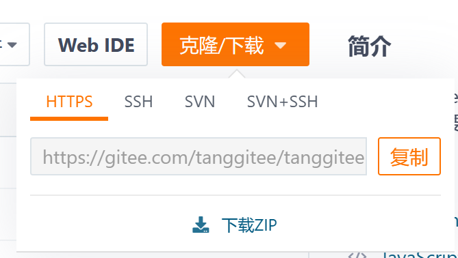

如果使用的是git命令克隆的，请务必！务必！务必！在查看功能中中勾选[隐藏的项目]

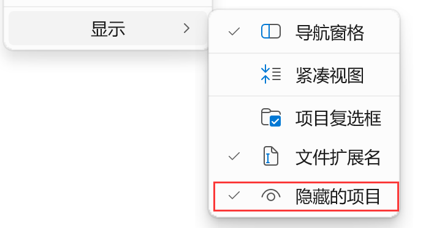

### 1.2 删除.Git文件夹

此文件夹中保存着原始的仓库信息，如果不删除就进行修改并进行上传推送，代码将推送给原始的gitee仓库，也就是我的仓库，带来不必要的麻烦)

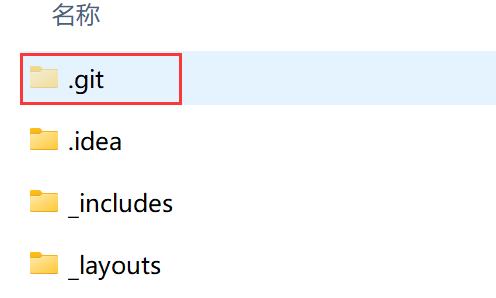

### 1.3 上传至自己的Gitee仓库

#### 1.3.1 建立仓库

建立一个与自己用户名相同名称的仓库(中文的自己看网址确认拼音)，开源，不用初始化.

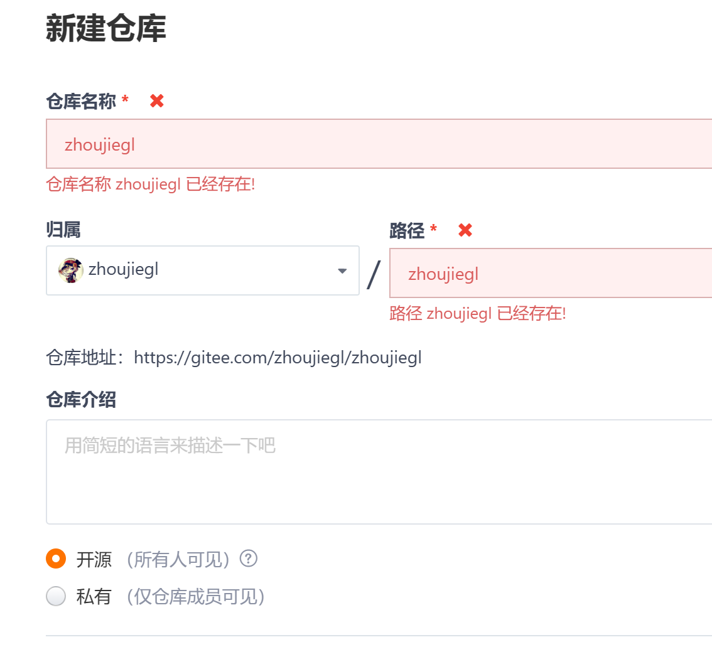

#### 1.3.2 使用GitHub Desktop克隆到本地

虽然是GitHub 的项目，但本质用的都是git指令，所以也可以上传Gitee.

- 下载地址：[GitHub Desktop | Simple collaboration from your desktop](https://desktop.github.com/)

- 汉化程序下载地址：[robotze/GithubDesktopZhTool: Github Desktop 汉化工具 支持 Windows Mac Linux](https://github.com/robotze/GithubDesktopZhTool)

- 克隆远程仓库到本质
  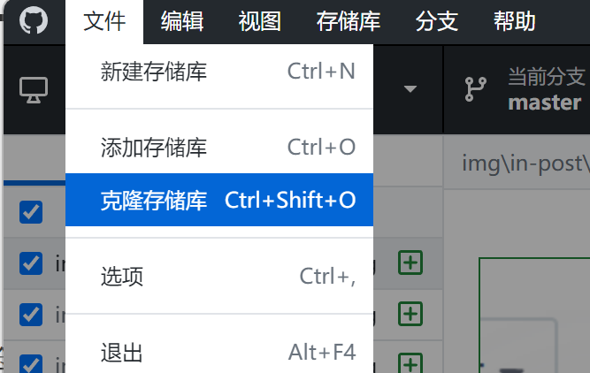

  仓库地址在自己的Gitee仓库中复制过来。

  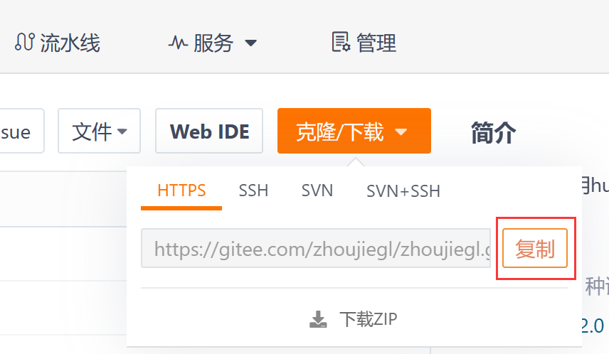

  Gitee对于GitHub来说属于第三方仓库，因此选择URL，本地地址一定要选择一个空的文件夹(注意，还不是你已经下载好了的模板文件夹)。完成后，该文件夹里将生成.git文件夹

  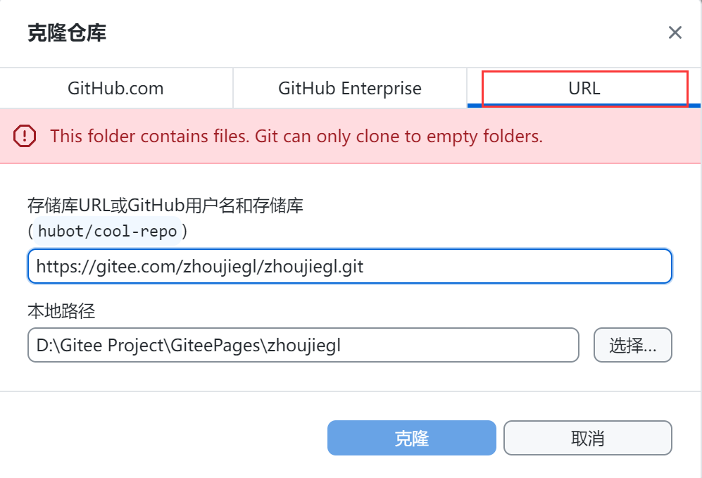

- 将模板文件夹里的文件全部拷贝至该文件夹

- GitHub Desktop会实时得出[本地文件夹]与[远程文件夹]的不同之处，提醒你更改了什么

- 上传流程

  - commit(提交)

    完成修改后，填好左下角的摘要，点击Commit即可(还没有上传到远程，只是提交在缓存区)

    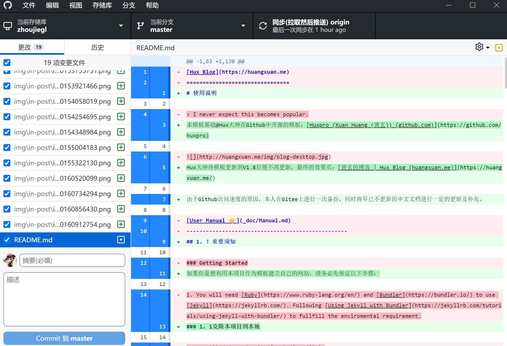

  - push(推送)

    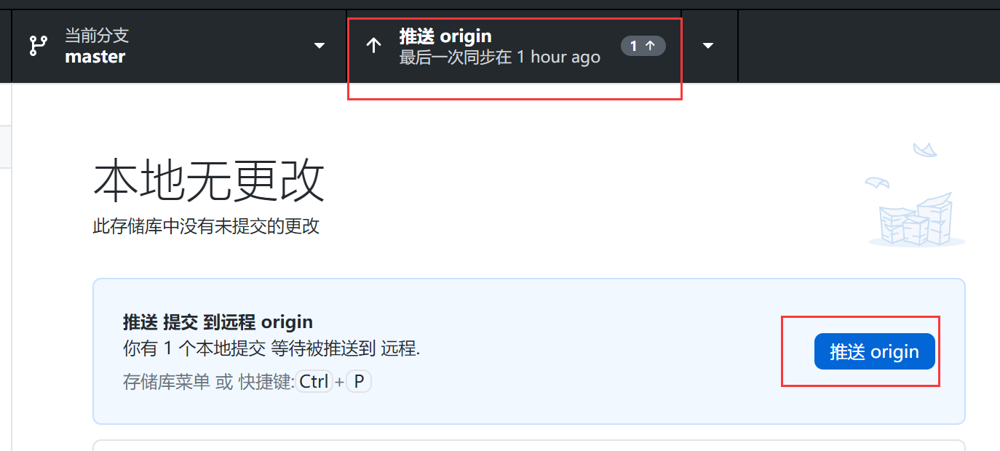

    点击推送，即可同步到远程仓库，在Gitee网页刷新一下，就能看到变化

### 1.4 托管网站

#### 1.4.1 GiteePages服务的申请

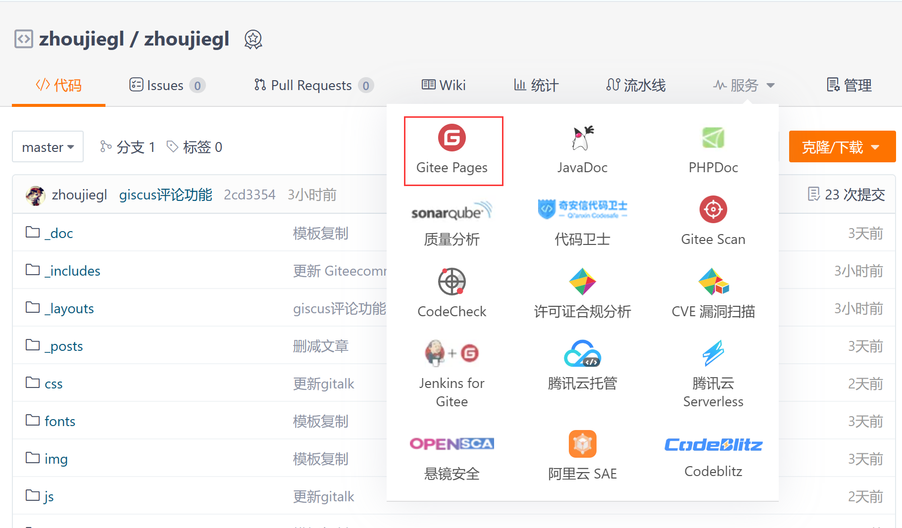

- 国内有较为严格的审核机制，需要上传身份证正反面以及手持身份证正反面的照片，等待2~3个工作日.

#### 1.4.2 部署/更新网站

按如下设置，每一次将代码同步到自己的仓库后，都需要在GiteePages 设置界面点击**更新**，否则网站是不会改变的

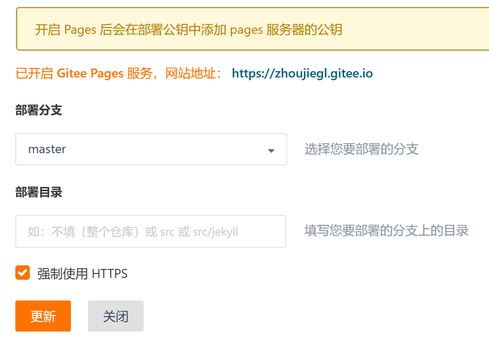

#### 1.4.3 使用你的特殊域名浏览网站吧！

最开始的仓库名和Gitee帐号名相同，此时才能得到一个简洁的网址：https://你的用户名.gitee.io

## 2. 为本地配置Jekyll环境

此模板使用了Jekyll技术，本地电脑是没有此环境的，因此直接打开html只能看到非常杂乱的页面。配置环境，将使你能够在修改代码后，迅速在自己的电脑中查看效果，满意之后再进行上传→推送→部署，这将极大的节约时间效率。

### 2.1 安装Ruby

这是Jekyll的源代码语言环境

官网：[Downloads (rubyinstaller.org)](https://rubyinstaller.org/downloads/)

下载推荐的版本即可(有箭头的)：

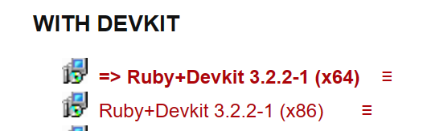

双击安装即可，路径可改可不改，中间的√都按推荐即可，不用修改，到最终安装完成的界面的√打上，会运行如下界面：输入3，回车，等待安装完成。

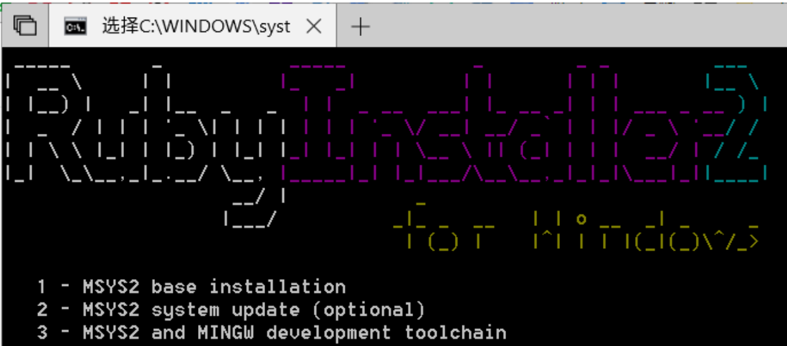

完成后，你的电脑就可以使用 **gem** 系列的指令了。按几下回车退出

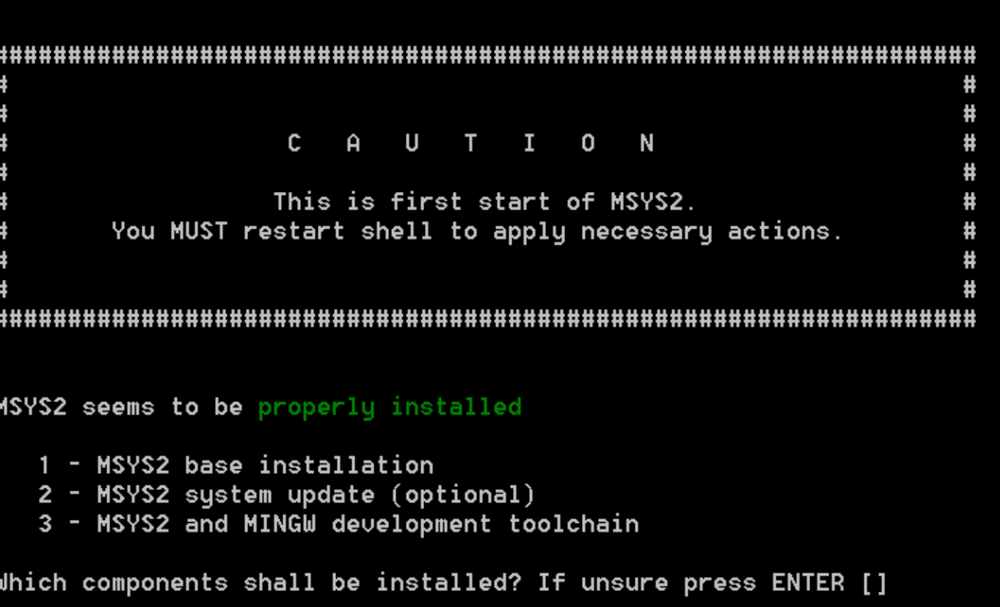

你可以重开一个cmd，输入**gem -v** 查看版本信息确认是否安装成功。

### 2.2  安装环境依赖

不理解这句话没关系，总之就是下载一些必要的配件。打开cmd输入：

- **gem install jekyll**，回车等待安装完成。此步完成，电脑将可以使用 **bundle** 系列指令
  如果此指令长期没有反应，可以执行以下命令后再执行：

  ```ruby
  gem sources --remove https://rubygems.org/		**移除原下载站点
  gem sources -a https://gems.ruby-china.com			**使用新的下载站点
  ```

  

  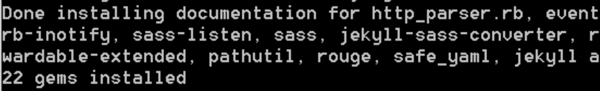

- 选中你的项目所在文件夹，按住shift右键鼠标→在终端中打开，输入：

  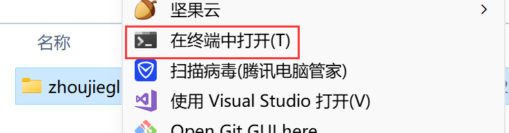

- **bundle install**，回车耐心等待安装完成。这个命令会读取你文件夹中的Gemfile，下载该文件中记录的插件。安装完成后，本地修改浏览网站所需的所有配置就齐了。
  如果这个指令长时间没有反应，可以先执行一次**bundle config mirror.https://rubygems.org https://gems.ruby-china.com**来切换国内的镜像下载

- 验证网站能否正常打开

  同上，在终端中打开文件夹，输入【bundle exec jekyll serve】回车等待网站生成

  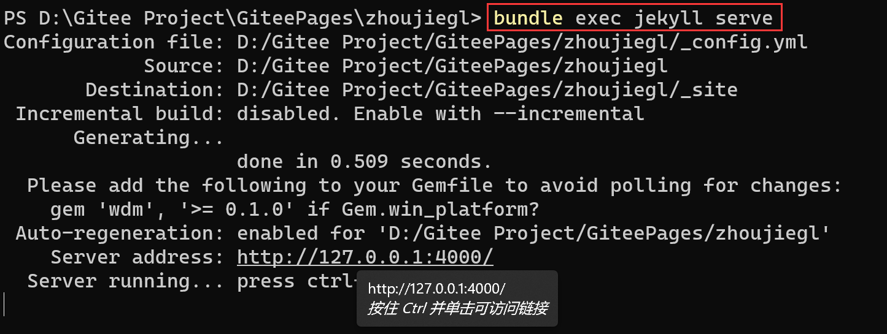

  按住Ctrl鼠标左键单击[Server address]后的本地网址，即可使用本地的浏览器打开生成的网站。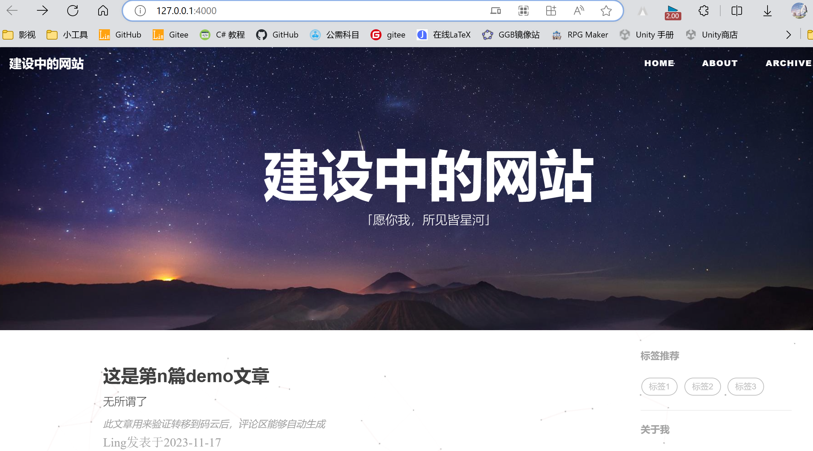

- 此时你可以用编辑器对代码进行修改，cmd保持运行时会实时更新你的修改，此时刷新浏览器便可以实时看到修改后的效果。

## 3. 本地修改模板

### 3.1 代码编辑器下载安装

此处不再赘述，本人使用的是vscode

### 3.2 可修改的部分

太多了，有时间的时候慢慢补全，基本功能可查看@Hux大神的原始文档，但写法比较硬核，对代码水平一般的朋友可能不太友好。

### 3.3 评论区

使用[Waline](https://waline.js.org/)配置评论区

#### 3.3.1 Waline评论区的配置	

